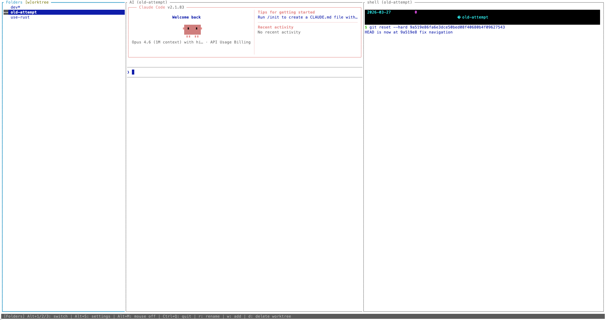

# agent-storm

A terminal UI for managing multiple AI coding sessions across project folders. Three-pane layout: folder picker, AI assistant (Claude Code by default), and a shell — all in one screen.



### Git worktree support

Point agent-storm at the parent directory that contains your worktree folders. Each worktree should be an immediate child directory:

```
my-project/              <-- open agent-storm here
  my-project.git/        <-- bare repo (auto-hidden)
  dev/                   <-- worktree
  feature-branch/        <-- worktree
```

```sh
ags -C ~/repos/my-project
```

When the directory contains git worktrees, agent-storm detects this automatically:

- Bare repo directories are hidden from the folder list
- Folders with uncommitted changes show a `*` indicator
- Press `w` to create a new worktree
- Press `d` to delete a worktree (with confirmation)
- The `post_worktree_cmd` runs in the shell after creation (e.g. `npm install`)

## Install

```sh
curl --proto '=https' --tlsv1.2 -fsSL https://raw.githubusercontent.com/electrovir/agent-storm/dev/install.sh | bash
```

This downloads the latest prebuilt binary for your platform and installs it to `/usr/local/bin` (macOS) or `~/.local/bin` (Linux). Both `agent-storm` and `ags` commands are available after install.

### Build from source

Requires [Rust](https://rustup.rs/).

```sh
git clone https://github.com/electrovir/agent-storm.git
cd agent-storm
cargo build --release
cp target/release/agent-storm /usr/local/bin/
ln -sf /usr/local/bin/agent-storm /usr/local/bin/ags
```

## Usage

```sh
# Browse folders in the current directory
ags

# Browse a specific directory
ags -C ~/repos/my-project

# Use a custom AI command
ags --ai-cmd "claude --model sonnet"

# Start with mouse capture enabled (click to focus panes)
ags --mouse
```

### Run from source (without installing)

```sh
git clone https://github.com/electrovir/agent-storm.git
cd agent-storm
cargo run -- -C ~/repos/my-project
```

Any flags go after the `--` separator. For example:

```sh
cargo run -- -C ~/repos/my-project --ai-cmd "claude --model sonnet" --mouse
```

### Layout

```
| Folders       | AI              | Shell           |
| *- fast-work  |                 |                 |
| -- merging    |  Claude Code    |  zsh / bash     |
|    prod       |                 |                 |
|                                                   |
| [Folders] Alt+1/2/3 | Alt+S: settings | Ctrl+Q    |
```

### Keybindings

| Key | Action |
|-----|--------|
| `Alt+1` / `Alt+2` / `Alt+3` | Focus folders / AI / shell pane |
| Click on a pane | Focus that pane (when mouse capture is on) |
| `Ctrl+Q` | Quit |
| `Alt+S` | Open settings |
| `Alt+M` | Toggle mouse capture (on: click to focus, off: text selection) |
| `Alt+F` | Toggle fullscreen for the focused AI/shell pane |
| `Alt+K` | Clear the focused pane's screen and scrollback |
| `Alt+R` | Force full screen redraw |

**Folder pane:**

| Key | Action |
|-----|--------|
| `j` / `k` or arrows | Navigate folders |
| `Enter` | Open sessions for selected folder (or switch to existing) |
| `r` | Rename selected folder (uses `git worktree move` for worktrees) |
| `w` | Add git worktree (only in worktree directories) |
| `d` | Delete selected worktree (with confirmation) |

### Folder status indicators

Each folder shows two characters before its name indicating pane status:

- spinner (green) — busy (produced output recently)
- `-` (grey) — idle (alive, waiting for input)
- `x` (red) — exited
- blank — no session

Format: `[AI][Shell] folder-name`, e.g. `*- merging` means AI is busy, shell is idle.

### Sessions

Sessions persist when you switch between folders. Select a folder you've already opened and the previous AI and shell sessions are still there.

### Config

Settings are stored in `~/.config/agent-storm.toml`:

```toml
ai_cmd = "claude"
post_worktree_cmd = "npm install"
mouse = false
```

- `ai_cmd` — command to run in the AI pane (default: `claude`)
- `post_worktree_cmd` — command to run in the shell after creating a new worktree (optional)
- `mouse` — enable mouse capture on startup for click-to-focus (default: `false`)

CLI flags (`--ai-cmd`, `--post-worktree-cmd`, `--mouse`) override config values.
